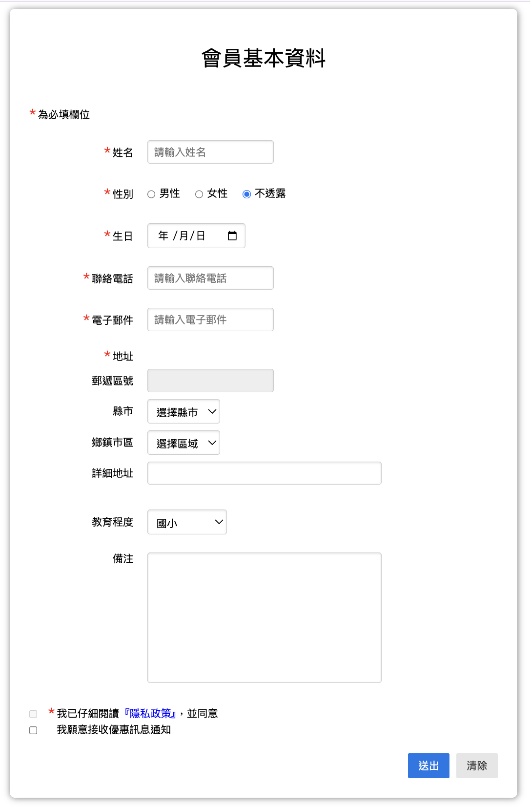
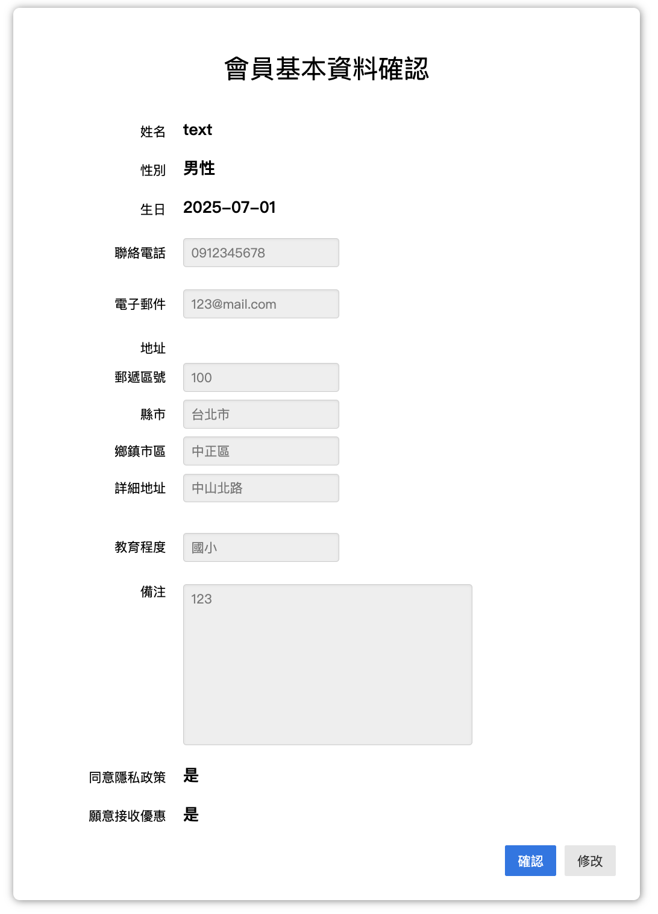
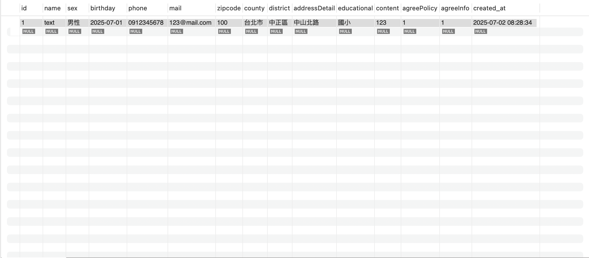

# 會員資料管理系統 (Member Management System)

## 專案簡介
本專案是一個基於 Java Servlet 與 JSP 的會員資料管理系統，實現了會員資料的填寫、確認與儲存功能。透過前端表單蒐集會員基本資料，並以 Servlet 處理表單提交，最終將資料寫入 MySQL 資料庫。整個流程包含資料驗證、資料綁定與頁面跳轉，適合作為 Web 應用開發的學習範例。

## 技術棧
- Java Servlet / JSP (Jakarta EE)
- MySQL 資料庫
- JSTL (JavaServer Pages Standard Tag Library)
- HTML5 / CSS3 (Pure.css 框架)
- JavaScript (jQuery、tw-city-selector 地區選擇器)
- JDBC 連線資料庫

## 主要功能
- 會員基本資料填寫（姓名、性別、生日、電話、電子郵件、地址、教育程度、備註等）
- 地址使用台灣縣市鄉鎮動態下拉選單 (tw-city-selector)
- 表單必填欄位驗證與格式檢查
- 填寫後資料確認頁面，展示填寫資料供用戶再次確認
- 會員資料寫入 MySQL 資料庫
- 完成送出後顯示感謝頁面

## 專案結構
/src/main/java/com/demo/controller/SubmitFormServlet.java # Servlet 控制器
/src/main/java/com/demo/domain/Member.java # JavaBean 會員資料類別
/webapp/index.jsp # 會員資料輸入表單
/webapp/check.jsp # 會員資料確認頁面
/webapp/finish.html # 送出完成頁面
/webapp/style.css # 網頁樣式

## 頁面預覽

### 會員填寫頁


### 資料確認頁


### 完成頁


### mySQL資料頁


## 使用說明
1. 確保本地或遠端有安裝並啟動 MySQL，建立名為 `work` 的資料庫，並建立 `members` 資料表，欄位結構與 Member JavaBean 對應。
2. 將專案部署到支援 Jakarta EE 的 Servlet 容器（如 Tomcat、TomEE）。
3. 在瀏覽器打開 `index.jsp`，填寫會員資料，依照頁面導引完成整個流程。

## 資料庫表格範例 (MySQL)
```sql
CREATE TABLE members (
    id INT AUTO_INCREMENT PRIMARY KEY,
    name VARCHAR(50) NOT NULL,
    sex VARCHAR(10),
    birthday DATE,
    phone VARCHAR(20),
    mail VARCHAR(100),
    zipcode VARCHAR(10),
    county VARCHAR(50),
    district VARCHAR(50),
    addressDetail VARCHAR(255),
    educational VARCHAR(50),
    content TEXT,
    agreePolicy BOOLEAN,
    agreeInfo BOOLEAN
);
